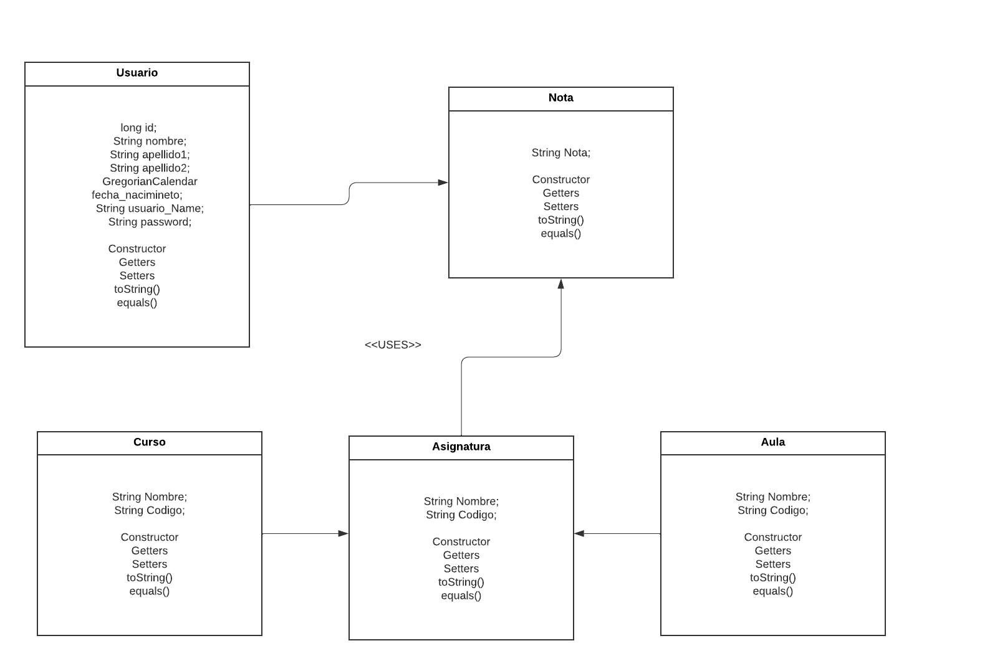
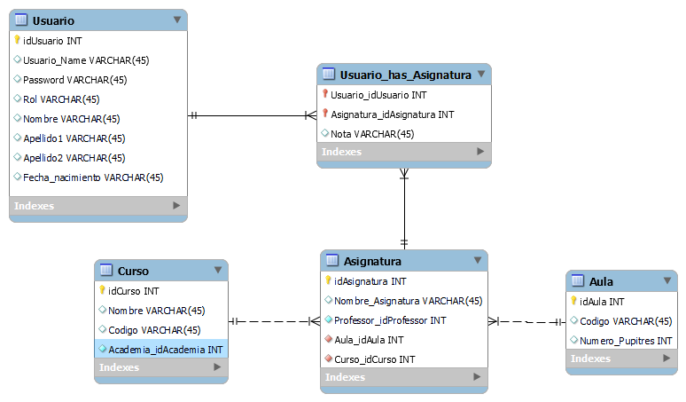

# Trabajo_2_Evaluacion_Academia

En este proyecto hemos puesto las siguientes Propiedades en application.properties;
Estas serian las cosas importantes mara la base de datos:

server.port=20000
spring.thymeleaf.cache=false

spring.jpa.hibernate.ddl-auto=update
spring.datasource.url=jdbc:mariadb://localhost:3308/academia
spring.datasource.username=root
spring.datasource.password=
spring.jpa.properties.hibernate.dialect=org.hibernate.dialect.MySQLDialect

<Importante> en el puerto preterminado que tenemos en xampp es 3306 pero en este caso lo cambie porque ya lo tenia en uso
Tambien el usuario es root sin  contraseña como se puede apreciar

Esta pagina funcionaria de la siguiente manera hay dos tipos de roles/vistas Null y admin

La de null que es la de usuario normal es para los estudiantes y tendria que mostrar las paginas de el navegador con su informacion personal de cada pagina

En cambia la parte admin mostraria en la pagina /pagina (que es la principal) mostraria un menu secundario al que solo pueden haceder y ver los admin.
Este modo de vision esta ahora para todos ya que en la presentacion me sera mas facil enseñar y explicar.

Se puede poner todo otravez con security solo quitando el comentado de la classe SecurityConfig